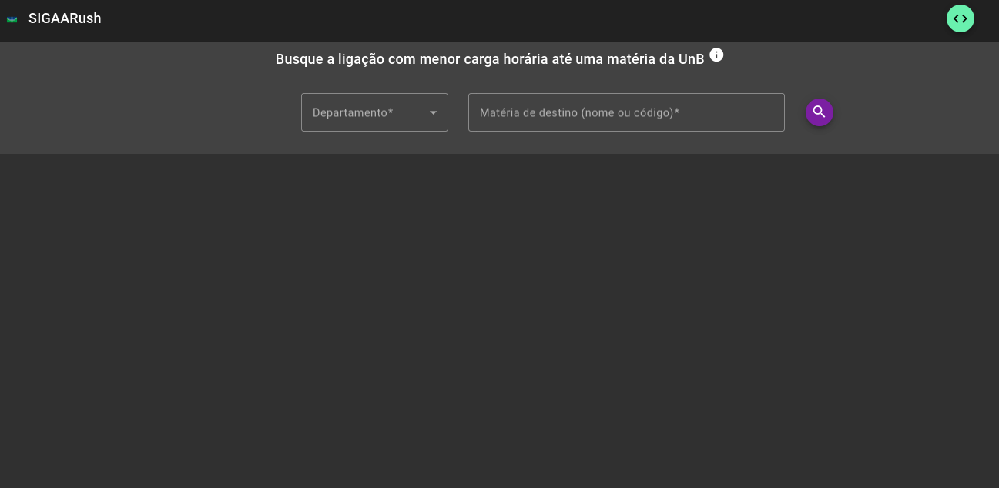
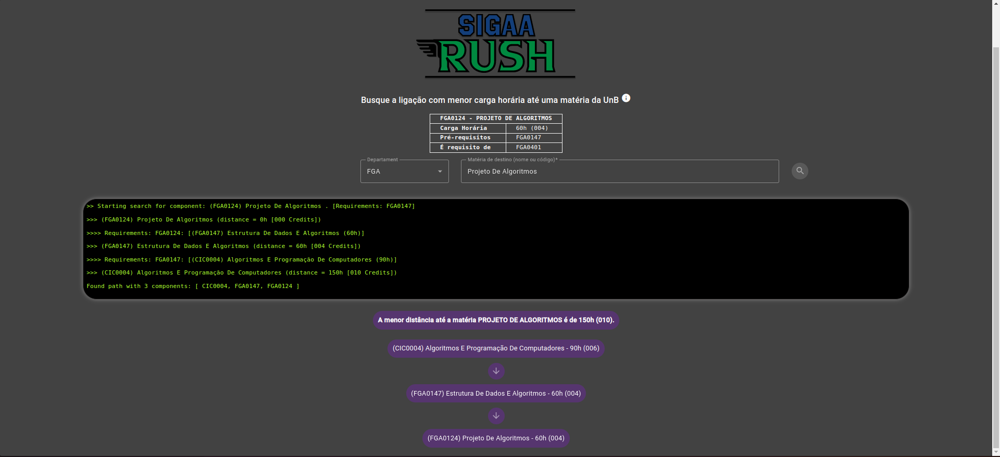
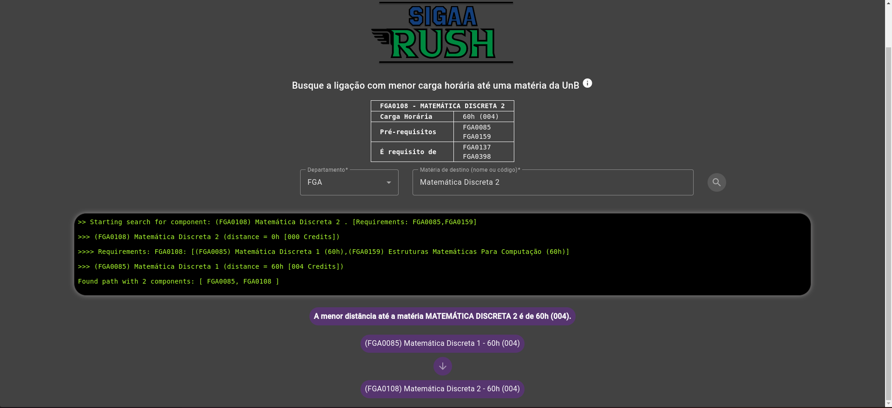
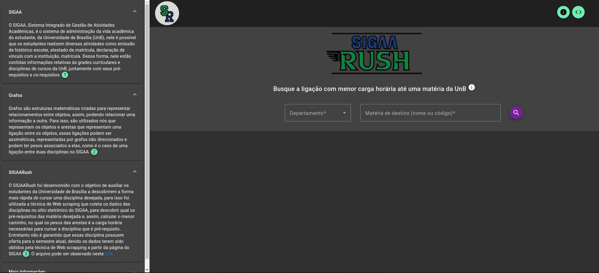

# SIGAARush

**Número da Lista**: Dupla 06 (T01)<br>
**Conteúdo da Disciplina**: Grafos 2<br>

## Alunos

| Matrícula  | Aluno                                                                   |
|------------|-------------------------------------------------------------------------|
| 19/0112123 | [Lucas Gabriel Sousa Carmargo Paiva](https://github.com/lucasgabriel-2) |
| 20/0042327 | [Nicolas Chagas Souza](https://github.com/nszchagas)                    |

## Sobre

O SIGAARush foi desenvolvido com o objetivo de auxiliar os estudantes da Universidade de Brasília a descobrirem a forma mais rápida de cursar uma disciplina desejada.Para isso foi utilizando o algoritmo de Dijkstra no qual o fluxo de disciplinas foi representado por um grafo direcionado com pesos nas arestas, onde os nós são as disciplinas e as arestas a quantidade de horas necessárias para cursar uma disciplina.


Os dados utilizados no projeto foram obtidos através da técnica de Web scraping realizada no sítio eletrônico do [SIGAA](https://sigaa.unb.br/sigaa/public/componentes/busca_componentes.jsf?aba=p-ensino)

## Screenshots

<center>



Figura 1 - Tela Inicial.

</center>



<center> Figura 2 - Exemplo de Busca.</center>



<center> Figura 3 - Exemplo de Busca.</center>



<center> Figura 4 - Aba de informações.</center>

## Instalação

**Linguagem**: Typescript@4.9.4<br>
**Framework**: Angular@15.2.0<br>

Para rodar o projeto localmente é necessário ter Node (^20.0.0) e Angular (^15.2.0) instalado na máquina. Recomendamos a utilização do Node Version Manager (nvm) para instalação da versão correta do node.

```shell

nvm install 20.0.0
nvm use 20.0.0
npm install angular@15.2.0 -g

```

- É **necessário** instalar as dependências do projeto, executando o seguinte comando na pasta raiz do projeto (a mesma onde se encontra o [package.json](./package.json).

```shell
npm install 
```

- Para rodar o projeto, basta executar o comando abaixo na raiz do projeto.

```shell
npm run start 
```

> Esse comando executará o script start definido no [package.json](./package.json), ou seja, iniciará o servidor angular expondo a porta padrão: 4200.

> Confira o aplicativo rodando em: [http://localhost:4200](http://localhost:4200). :)

## Uso

Para usar o projeto, acesse a página ([local](http://localhost:4200) ou no [github](https://projeto-de-algoritmos.github.io/Grafos2_SIGAARush/)), preencha o departamento e a matéria, clique no botão de lupa e a busca será iniciada.

## Outros

A busca por requisitos simultâneos (por exemplo: FAC -> PED1 & TED1) não foi implementada, e esses requisitos foram desconsiderados na hora dos cálculos.

## Apresentação

<video src='./assets/gravacao.mp4'></video>

[Arquivo de apresentação](./assets/gravacao.mp4)

## Referências

[1] Tracing the Path in DFS, BFS, and Dijkstra’s Algorithm - Baeldung. Disponível no [link](https://www.baeldung.com/cs/dfs-vs-bfs-vs-dijkstra&#41), acesso em 20/04/2023.<br>
[2] Algoritmo de Dijkstra para caminho barato num grafo com custos positivos. Ime.usp.br. Disponível no [link](https://www.ime.usp.br/~pf/algoritmos_para_grafos/aulas/dijkstra.html). Acesso em: 12/05/2023.

‌
